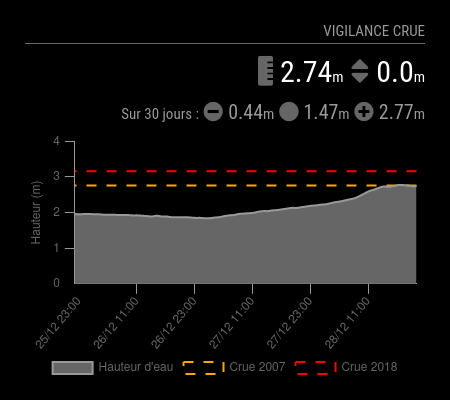
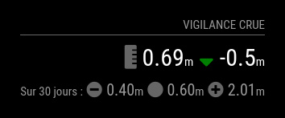
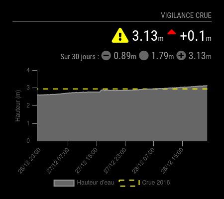

# Module: MMM-VigiCrues
This module displays the last value of water level at a station in the Vigicrues network in France, including chart and statistical information (minimum, average, maximum).

The max-height and max-width of the chart can be fixed. The amplitude and interval of the graph data and the age of the data used to determine the level assessment can also be fixed. Color Legend and chart display may be enabled or disabled independently. The color of the graphic elements can be customized.

<p align="left">



</p>

[MagicMirror Project on Github](https://github.com/MichMich/MagicMirror) | [Vigicrues](https://www.vigicrues.gouv.fr/)

## Installation:

In your terminal, go to your MagicMirror's Module folder:

```shell
cd ~/MagicMirror/modules
```
Clone this repository:
```shell
git clone https://github.com/grenagit/MMM-VigiCrues
```

Configure the module in your config.js file.

## Update:

In your terminal, go to your MMM-VigiCrues's Module folder:

```shell
cd ~/MagicMirror/modules/MMM-VigiCrues
```
Incorporate changes from this repository:
```shell
git pull
```

## Configuration:

### Basic configuration

To use this module, add it to the modules array in the `config/config.js` file:
```javascript
modules: [
	{
		module: "MMM-VigiCrues",
		position: "top_left",
		config: {
			stationid: "A123456789" // Station identifer (www.vigicrues.gouv.fr)
		}
	}
]
```
### Options

The following properties can be configured:


| Option                       | Description
| ---------------------------- | -----------
| `stationid`                  | The station identifer, which can be obtained on [Vigicrues](https://www.vigicrues.gouv.fr) portal (tab *Info Station*). <br><br>  This value is **REQUIRED**
| `dataPeriod`                 | How often does the content needs to be fetched? (Minutes) <br><br> **Possible values:** `30` - `43200` <br> **Default value:** `3 * 24 * 60` (3 days)
| `dataInterval`               | How often does the content needs to be fetched? (Minutes) <br><br> **Possible values:** `10` - `60` <br> **Default value:** `60` (1 hour)
| `comparisonPeriod`           | How often does the content needs to be fetched? (Minutes) <br><br> **Possible values:** `10` - `43200` <br> **Default value:** `2 * 60` (2 hours past)
| `updateInterval`             | How often does the content needs to be fetched? (Milliseconds) <br><br> **Possible values:** `1000` - `86400000` <br> **Default value:** `1 * 60 * 60 * 1000` (1 hour)
| `animationSpeed`             | Speed of the update animation. (Milliseconds) <br><br> **Possible values:**`0` - `5000` <br> **Default value:** `1000` (1 second)
| `maxChartWidth`              | Maximum width for chart display. If set to 0, the chart's default width is used. (Pixels) <br><br> **Possible values:**`0` - `5000` <br> **Default value:** `0` (default width)
| `maxChartHeight`             | Maximum height for chart display. If set to 0, the chart's default height is used. (Pixels) <br><br> **Possible values:**`0` - `5000` <br> **Default value:** `0` (default height)
| `beginAtZero`                | The water level axis will begin at 0. <br><br> **Possible values:** `true` or `false` <br> **Default value:** `true`
| `useColorLegend`             | Use the colored icons. <br><br> **Possible values:** `true` or `false` <br> **Default value:** `true`
| `showChart`                  | Show the chart. <br><br> **Possible values:** `true` or `false` <br> **Default value:** `true`
| `showChartBackground`        | Show the chart background. <br><br> **Possible values:** `true` or `false` <br> **Default value:** `true`
| `colorLine`                  | Color of the line and grid lines.<br><br> **Possible values:** `'#000000'` - `'#ffffff'` <br> **Default value:** `'#999'`
| `colorBackground`            | Color of the background (below the line).<br><br> **Possible values:** `'#000000'` - `'#ffffff'` <br> **Default value:** `'#666'`
| `colorLegend`                | Color of legend text.<br><br> **Possible values:** `'#000000'` - `'#ffffff'` <br> **Default value:** `'#666'`
| `colorTick`                  | Color of tick labels.<br><br> **Possible values:** `'#000000'` - `'#ffffff'` <br> **Default value:** `'#666'`
| `colorLabel`                 | Color of scale title.<br><br> **Possible values:** `'#000000'` - `'#ffffff'` <br> **Default value:** `'#666'`
| `alertTable`                 | Your alerts (water level, title, colour). <br><br> **Possible values:** view details below <br> **Default value:** `[]`
| `initialLoadDelay`           | The initial delay before loading. If you have multiple modules that use the same API key, you might want to delay one of the requests. (Milliseconds) <br><br> **Possible values:** `1000` - `5000` <br> **Default value:**  `0`
| `apiBase`                    | The Vigicrues API base URL. <br><br> **Default value:**  `'https://www.vigicrues.gouv.fr/'`
| `hydroEndpoint`              | The observations endPoint. <br><br> **Default value:**  `'services/observations.json/'`

### Alert Table

With `alertTable`, you can create your own alerts based on water level. This information will be added on the chart and an alert will be displayed if the current water level exceeds the water level corresponding to the alert.

You can create one or more alerts within the following structure :

```javascript
alertTable: [
	{ "value": 5430, "title": "Flood 2017", "color": "red" }, // Alert set to 5430 mm displayed in red with the title "Flood 2017"
	{ "value": 3120, "title": "Flood 2014", "color": "orange" }, // Alert set to 3120 mm displayed in orange with the title "Flood 2014"
]
```

## Todo


## License

This module is licensed under the MIT License
